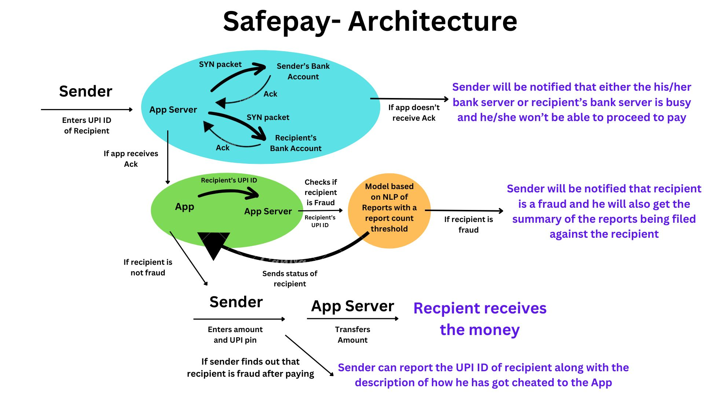

# SafePay- Making Transcations Safe and Secure
This is a project made by team HackSquad at Hack4Soc 2.0 Hackathon conducted by IEEE Computer Society RVCE and Hack2Skill at RV College of Engineering, Bangalore.

## Safepay is a platform for safe and secure transactions.
### Tech Stack: React-native, Flask, Firebase, Cohere API

### SafePay secures your transactions by the concept of reliable data transfer where connection is established between bank accounts prior transactions, so you don't need to worry about losing the money in between while making transactions(Tackles the payment issue where your money gets debited and the recipient doesn't receive it and bank takes 3-5 working days to refund)

### SafePay also ensures safety: While buying products online, people often lack trust and have a fear that the person is fraud. SafePay resolves this by warning our users prior transaction if the recipient is fraud by analysing the reports filed against the fraud. Thus, people can feel safe to make transactions with online businesses.
